# ESizzle PDF Manipulation System - Architecture Document

## Table of Contents
1. [System Overview](#system-overview)
2. [Architecture Components](#architecture-components)
3. [Data Flow Diagrams](#data-flow-diagrams)
4. [Component Interactions](#component-interactions)
5. [Processing Workflows](#processing-workflows)
6. [Database Schema](#database-schema)
7. [Security Architecture](#security-architecture)
8. [Scalability & Performance](#scalability--performance)

---

## System Overview

The ESizzle PDF Manipulation System is a modern, cloud-native solution that replaces the legacy C# Watchman/Workman plugin architecture with a scalable Vue.js frontend and Python Lambda backend. The system enables real-time PDF manipulation operations including redactions, rotations, page deletions, and document splitting while maintaining full compatibility with the existing LoanMaster database schema.

### Key Architecture Principles
- **Microservices**: Decoupled components with clear boundaries
- **Event-Driven**: Asynchronous processing with real-time progress updates
- **Cloud-Native**: Leverages AWS managed services for scalability
- **Database Compatibility**: Zero-downtime migration from existing system
- **Security-First**: End-to-end encryption and audit trails

---

## Architecture Components

### Frontend Layer (Vue.js)
- **Technology**: Vue.js 3 + TypeScript + Pinia + Tailwind CSS
- **Components**: PDF viewer, annotation overlays, manipulation tools
- **Features**: Real-time visual feedback, coordinate translation, progress tracking
- **Location**: `esizzle-frontend/`

### API Layer (C# .NET)
- **Technology**: ASP.NET Core Web API
- **Role**: Authentication, authorization, database operations, Lambda orchestration
- **Features**: RESTful endpoints, Lambda integration, progress callbacks
- **Location**: `esizzle-api/`

### Processing Layer (Python Lambda)
- **Technology**: Python 3.9 + PyMuPDF + boto3
- **Functions**: PDF manipulation processors, S3 file management, orchestrated workflows
- **Features**: Sequential processing coordination, error recovery, audit logging
- **Location**: `lambda/pdf-processor/`
- **Core Component**: `ManipulationOrchestrator` - coordinates all processing operations

### Infrastructure Layer (AWS CDK)
- **Technology**: AWS CDK v2 + TypeScript
- **Resources**: Lambda functions, VPC, Security Groups, IAM roles
- **Features**: Infrastructure as code, environment management
- **Location**: `cdk/`

### Data Layer
- **Database**: MySQL (LoanMaster) - existing schema
- **Storage**: AWS S3 - multiple paths (Original, Processing, Production, RedactOriginal)
- **Cache**: In-memory processing state management

---

## Data Flow Diagrams

### High-Level System Architecture

```mermaid
graph TB
    User[👤 User] --> Frontend[🖥️ Vue.js Frontend<br/>esizzle-frontend]
    
    Frontend --> API[🔧 C# Web API<br/>esizzle-api]
    
    API --> DB[(📊 MySQL Database<br/>LoanMaster)]
    API --> Lambda[⚡ Python Lambda<br/>pdf-processor]
    
    Lambda --> S3[☁️ AWS S3<br/>Document Storage]
    Lambda --> DB
    
    S3 --> |PDF Files| Lambda
    Lambda --> |Processed PDFs| S3
    
    API --> |Progress Updates| Frontend
    Lambda --> |Progress Callbacks| API
```



### Detailed Data Flow - PDF Manipulation Process

```
┌─────────────────┐    ┌──────────────────┐    ┌─────────────────┐    ┌──────────────────┐
│   Vue.js UI     │    │   C# Web API     │    │  Python Lambda  │    │    AWS S3        │
│                 │    │                  │    │                 │    │                  │
├─────────────────┤    ├──────────────────┤    ├─────────────────┤    ├──────────────────┤
│                 │    │                  │    │                 │    │                  │
│ 1. User draws   │───▶│ 2. Save          │───▶│                 │    │                  │
│    redaction    │    │    manipulation  │    │                 │    │                  │
│    overlay      │    │    metadata      │    │                 │    │                  │
│                 │    │    to database   │    │                 │    │                  │
│                 │    │                  │    │                 │    │                  │
│ 3. Click        │───▶│ 4. Update image  │    │                 │    │                  │
│    "Apply"      │    │    status to     │    │                 │    │                  │
│                 │    │    "InWorkman"   │    │                 │    │                  │
│                 │    │                  │    │                 │    │                  │
│ 6. Show         │◄───│ 5. Invoke Lambda │───▶│ 7. main.py      │    │                  │
│    processing   │    │    function      │    │    entry point  │    │                  │
│    indicator    │    │    async         │    │         ↓       │    │                  │
│                 │    │                  │    │ 8. ORCHESTRATOR │◄───│ Processing/      │
│                 │    │                  │    │    coordinates  │    │ path/file.pdf    │
│                 │    │                  │    │    all operations│    │                  │
│                 │    │                  │    │         ↓       │    │                  │
│                 │    │                  │    │ 9. Create backup│───▶│ RedactOriginal/  │
│                 │    │                  │    │    (if needed)  │    │ backup.pdf       │
│                 │    │                  │    │         ↓       │    │                  │
│                 │    │                  │    │ 10. Redaction   │    │                  │
│                 │    │                  │    │     Processor   │    │                  │
│                 │    │                  │    │         ↓       │    │                  │
│                 │    │                  │    │ 11. Rotation    │    │                  │
│                 │    │                  │    │     Processor   │    │                  │
│                 │    │                  │    │         ↓       │    │                  │
│                 │    │                  │    │ 12. Deletion    │    │                  │
│                 │    │                  │    │     Processor   │    │                  │
│                 │    │                  │    │         ↓       │    │                  │
│                 │    │                  │    │ 13. Splitting   │    │                  │
│                 │    │                  │    │     Processor   │    │                  │
│                 │    │                  │    │         ↓       │    │                  │
│ 16. Update UI   │◄───│ 15. Progress     │◄───│ 14. Upload      │───▶│ Processing/      │
│     with        │    │     callback     │    │     processed   │    │ path/file.pdf    │
│     result      │    │     to API       │    │     PDF         │    │ (modified)       │
│                 │    │                  │    │         ↓       │    │                  │
│                 │    │                  │    │ 17. Update DB   │    │                  │
│                 │    │                  │    │     status &    │    │                  │
│                 │    │                  │    │     metadata    │    │                  │
└─────────────────┘    └──────────────────┘    └─────────────────┘    └──────────────────┘
```

### Lambda Function Internal Architecture - ManipulationOrchestrator

```
Lambda Function Internal Data Flow:

main.py (Entry Point)
    ↓
ManipulationOrchestrator.process_document_manipulations()
    ↓
1. Load image record and manipulation data from database
    ↓
2. Download PDF from S3 Processing path
    ↓
3. Create backup in RedactOriginal (if manipulations exist)
    ↓
4. Sequential Processing (ORDER IS CRITICAL):
    │
    ├─→ RedactionProcessor.process() ────┐
    │   • Apply redaction annotations     │
    │   • Rasterize pages for security    │
    │   • Mark redactions as applied      │
    │                                     │
    ├─→ RotationProcessor.process() ──────┤
    │   • Apply page rotations            │ (PDF bytes passed
    │   • Update page orientations        │  between processors)
    │                                     │
    ├─→ DeletionProcessor.process() ──────┤
    │   • Remove specified pages          │
    │   • Update page count               │
    │                                     │
    └─→ SplittingProcessor.process() ─────┘
        • Split into multiple documents
        • Create new image records
        • Mark original as obsolete
    ↓
5. Upload processed PDF back to S3
    ↓
6. Update database status and metadata
```

### S3 Storage Architecture

```
AWS S3 Bucket: esizzle-documents
├── Original/
│   └── [path]/[imageId]/[imageId].pdf           # Original uploaded files
├── Processing/
│   └── [path]/[imageId]/[imageId].pdf           # Working files for manipulation
├── Production/
│   └── [path]/[imageId]/[imageId].pdf           # Final processed files
├── RedactOriginal/
│   └── [path]/[imageId]/[imageId].pdf           # Backup before redactions
└── Thumbnails/
    └── [path]/[imageId]/
        ├── thumb_page_001.jpg
        ├── thumb_page_002.jpg
        └── ...
```

### Database Interaction Flow

```
┌─────────────────┐    ┌──────────────────┐    ┌─────────────────┐
│  Frontend UI    │    │   C# Web API     │    │  MySQL Database │
│                 │    │                  │    │                 │
├─────────────────┤    ├──────────────────┤    ├─────────────────┤
│                 │    │                  │    │                 │
│ 1. Save         │───▶│ 2. Insert into   │───▶│ ImageRedaction  │
│    redaction    │    │    ImageRedaction│    │ table           │
│    coordinates  │    │    table         │    │                 │
│                 │    │                  │    │                 │
│ 3. Save page    │───▶│ 4. Insert into   │───▶│ ImageRotation   │
│    rotation     │    │    ImageRotation │    │ table           │
│                 │    │    table         │    │                 │
│                 │    │                  │    │                 │
│ 5. Mark page    │───▶│ 6. Insert into   │───▶│ ImagePageDeletion│
│    for deletion │    │    ImagePageDeletion  │ table           │
│                 │    │    table         │    │                 │
│                 │    │                  │    │                 │
│ 7. Create page  │───▶│ 8. Insert into   │───▶│ ImageBookmark   │
│    break        │    │    ImageBookmark │    │ table           │
│                 │    │    table         │    │                 │
│                 │    │                  │    │                 │
│ 9. Process all  │───▶│ 10. Update       │───▶│ Images.Status = │
│    manipulations│    │     image status │    │ "InWorkman"     │
│                 │    │                  │    │                 │
│ 11. Processing  │◄───│ 12. Lambda reads │◄───│ Read all        │
│     started     │    │     manipulation │    │ manipulation    │
│                 │    │     data         │    │ records         │
│                 │    │                  │    │                 │
│ 13. Final       │◄───│ 14. Update       │───▶│ Mark redactions │
│     status      │    │     applied      │    │ as Applied=true │
│                 │    │     flags &      │    │ Update status   │
│                 │    │     status       │    │ to "NeedsProcessing" │
└─────────────────┘    └──────────────────┘    └─────────────────┘
```

---

## Component Interactions

### 1. Frontend-to-API Communication

**Endpoint**: `POST /api/documents/{documentId}/redactions`
```typescript
// Frontend saves redaction coordinates
const redactionData = {
  imageId: 12345,
  pageNumber: 0,
  pageX: 150.5,
  pageY: 200.0,
  pageWidth: 250.0,
  pageHeight: 30.0,
  text: "Sensitive Information",
  createdBy: currentUserId
};

await api.post(`/documents/${documentId}/redactions`, [redactionData]);
```

**Endpoint**: `POST /api/documents/{documentId}/process-manipulations`
```typescript
// Trigger processing
const response = await api.post(`/documents/${documentId}/process-manipulations`);
const sessionId = response.data.sessionId;

// Poll for progress
const interval = setInterval(async () => {
  const status = await api.get(`/processing/${sessionId}/status`);
  updateProgressBar(status.data.progress);
  
  if (status.data.status === 'completed') {
    clearInterval(interval);
    refreshDocument();
  }
}, 2000);
```

### 2. API-to-Lambda Invocation

**Lambda Invocation Payload**:
```csharp
// C# API invokes Lambda function
var lambdaPayload = new {
    operation = "process_manipulations",
    imageId = documentId,
    sessionId = Guid.NewGuid().ToString(),
    timeout = 840,
    progressCallbackUrl = $"{_apiBaseUrl}/api/processing/progress"
};

var response = await _lambdaClient.InvokeAsync(new InvokeRequest {
    FunctionName = "esizzle-pdf-processor",
    InvocationType = InvocationType.Event, // Async
    Payload = JsonSerializer.Serialize(lambdaPayload)
});
```

### 3. Lambda-to-S3 Operations

**Download PDF for Processing**:
```python
# Lambda downloads PDF from S3
def download_pdf(self, s3_path: str, bucket_prefix: str) -> bytes:
    bucket_name = f"{bucket_prefix}-documents"
    response = self.s3_client.get_object(
        Bucket=bucket_name,
        Key=s3_path
    )
    return response['Body'].read()

# Usage
processing_path = f"Processing/{image_record['Path']}/{image_id}/{image_id}.pdf"
pdf_bytes = s3_manager.download_pdf(processing_path, image_record['BucketPrefix'])
```

**Upload Processed PDF**:
```python
# Lambda uploads processed PDF back to S3
def upload_pdf(self, pdf_bytes: bytes, s3_path: str, bucket_prefix: str):
    bucket_name = f"{bucket_prefix}-documents"
    self.s3_client.put_object(
        Bucket=bucket_name,
        Key=s3_path,
        Body=pdf_bytes,
        ContentType='application/pdf'
    )

# Create backup before processing
backup_path = f"RedactOriginal/{image_record['Path']}/{image_id}/{image_id}.pdf"
s3_manager.upload_pdf(original_pdf_bytes, backup_path, bucket_prefix)

# Save processed result
s3_manager.upload_pdf(processed_pdf_bytes, processing_path, bucket_prefix)
```

### 4. Lambda-to-Database Operations

**Read Manipulation Data**:
```python
# Lambda reads redactions from database
def get_pending_redactions(self, image_id: int) -> List[Dict[str, Any]]:
    query = """
        SELECT ID, ImageID, PageNumber, PageX, PageY, PageWidth, PageHeight,
               Guid, Text, CreatedBy, DateCreated, DrawOrientation
        FROM ImageRedaction 
        WHERE ImageID = %s AND Applied = 0 AND Deleted = 0
        ORDER BY PageNumber, PageY
    """
    return self.execute_query(query, (image_id,))
```

**Update Processing Status**:
```python
# Mark redactions as applied
def mark_redaction_applied(self, redaction_id: int):
    query = "UPDATE ImageRedaction SET Applied = 1 WHERE ID = %s"
    self.execute_update(query, (redaction_id,))

# Update image status
def update_image_status(self, image_id: int, status: str):
    query = "UPDATE Images SET Status = %s WHERE ID = %s"
    self.execute_update(query, (status, image_id))
```

---

## Processing Workflows

### Redaction Processing Workflow

```
1. Frontend: User draws redaction box
   ├── Calculate page coordinates
   ├── Store temporarily in component state
   └── Show yellow overlay with dashed border

2. Save Redaction:
   ├── Convert canvas coordinates to PDF coordinates
   ├── POST to /api/documents/{id}/redactions
   └── API saves to ImageRedaction table

3. Process Redactions:
   ├── POST to /api/documents/{id}/process-manipulations
   ├── API invokes Lambda function asynchronously
   └── Return sessionId for progress tracking

4. Lambda Processing:
   ├── Download PDF from S3 Processing path
   ├── Create backup in RedactOriginal path
   ├── Load PDF with PyMuPDF (fitz)
   ├── For each redaction:
   │   ├── Create redaction annotation at coordinates
   │   ├── Apply redaction (creates black overlay)
   │   └── Rasterize page to prevent text extraction
   ├── Save processed PDF back to S3
   ├── Mark redactions as Applied=1 in database
   └── Update image status to NeedsProcessing

5. Progress Updates:
   ├── Lambda sends progress via callback API
   ├── Frontend polls /processing/{sessionId}/status
   └── UI shows progress bar and completion status

6. Completion:
   ├── Frontend refreshes PDF viewer
   ├── Redaction overlays now show as black (applied)
   └── Processing indicator disappears
```

### Page Break & Document Splitting Workflow

```
1. Create Page Break:
   ├── User clicks at page boundary in pagebreak mode
   ├── Select document type from dropdown
   ├── Green bar appears at page break location
   └── Save to ImageBookmark table

2. Document Splitting Process:
   ├── Lambda groups pages by break points
   ├── For each section:
   │   ├── Create new PDF with page range
   │   ├── Insert new record in Images table
   │   ├── Upload split PDF to all S3 paths
   │   └── Update ImageBookmark.ResultImageID
   ├── Mark original document as Obsolete
   └── Create ImageSplitLog records for audit

3. Result:
   ├── Original document marked as obsolete
   ├── Multiple new documents created
   ├── Each document has correct classification
   └── User sees notification of split results
```

### Page Rotation Workflow

```
1. Apply Rotation:
   ├── User selects page and rotation angle
   ├── Save to ImageRotation table
   └── Show rotation indicator on page

2. Process Rotation:
   ├── Lambda reads rotation records
   ├── For each page with rotation:
   │   ├── Apply rotation using fitz.Page.set_rotation()
   │   └── Maintain aspect ratio and layout
   ├── Save processed PDF
   └── UI reflects new page orientation
```

### Page Deletion Workflow

```
1. Mark for Deletion:
   ├── User clicks page in deletion mode
   ├── Save to ImagePageDeletion table
   └── Show red X overlay on page

2. Process Deletion:
   ├── Lambda collects pages to delete
   ├── Sort in reverse order (maintain indices)
   ├── Use fitz.Document.delete_page() for each
   ├── Update page count in database
   └── If all pages deleted, mark document as deleted

3. Result:
   ├── PDF has fewer pages
   ├── Page numbering updated
   └── Deleted pages removed permanently
```

---

## Database Schema

### Core Tables (Existing - No Changes Required)

**Images Table**
```sql
CREATE TABLE Images (
    ID int PRIMARY KEY IDENTITY,
    Path nvarchar(500),
    FileName nvarchar(255),
    Status int, -- 0=NeedsImageManipulation, 1=InWorkman, 2=NeedsProcessing
    PageCount int,
    BucketPrefix nvarchar(50),
    DocTypeManualID int,
    CreatedBy int,
    DateCreated datetime,
    ModifiedBy int,
    DateModified datetime
);
```

**ImageRedaction Table**
```sql
CREATE TABLE ImageRedaction (
    ID int PRIMARY KEY IDENTITY,
    ImageID int,
    PageNumber int,           -- 0-based page index
    PageX float,              -- X coordinate in PDF units
    PageY float,              -- Y coordinate in PDF units
    PageWidth float,          -- Width of redaction area
    PageHeight float,         -- Height of redaction area
    Guid nvarchar(50),        -- Unique identifier
    Text nvarchar(max),       -- Optional redacted text
    Applied bit,              -- Whether redaction has been processed
    CreatedBy int,
    DateCreated datetime,
    Deleted bit DEFAULT 0,
    DrawOrientation int       -- Orientation when drawn (0,90,180,270)
);
```

**ImageRotation Table**
```sql
CREATE TABLE ImageRotation (
    ID int PRIMARY KEY IDENTITY,
    ImageID int,
    PageIndex int,            -- 0-based page index
    Rotate int               -- Rotation angle: 0, 90, 180, 270
);
```

**ImagePageDeletion Table**
```sql
CREATE TABLE ImagePageDeletion (
    ID int PRIMARY KEY IDENTITY,
    ImageID int,
    PageIndex int,            -- 0-based page index
    CreatedBy int,
    DateCreated datetime
);
```

**ImageBookmark Table** (Page Breaks)
```sql
CREATE TABLE ImageBookmark (
    ID int PRIMARY KEY IDENTITY,
    ImageID int,
    PageIndex int,            -- 0-based page index
    Text nvarchar(max),       -- Document type and metadata
    ImageDocumentTypeID int,  -- Classification for split document
    ResultImageID int,        -- Populated after document split
    IsGeneric bit,            -- Whether this is a generic break
    DisplayText nvarchar(255),
    Deleted bit DEFAULT 0
);
```

### Database Status Flow

```
Image Status Transitions:

NeedsImageManipulation (0)
    ↓ (User starts processing)
InWorkman (1)
    ↓ (Lambda processing completes)
NeedsProcessing (2)
    ↓ (Further processing/approval)
Production (3)
    ↓ (If split)
Obsolete (4)
```

---

## Security Architecture

### Network Security

```
┌─────────────────┐    ┌──────────────────┐    ┌─────────────────┐
│   Internet      │    │      VPC         │    │  Private Subnet │
│                 │    │                  │    │                 │
├─────────────────┤    ├──────────────────┤    ├─────────────────┤
│                 │    │                  │    │                 │
│ User Browser    │───▶│ Application      │───▶│ Lambda Functions│
│ (HTTPS)         │    │ Load Balancer    │    │ (pdf-processor) │
│                 │    │                  │    │                 │
│                 │    │ C# Web API       │───▶│ MySQL Database  │
│                 │    │ (EC2/ECS)        │    │ (RDS)           │
│                 │    │                  │    │                 │
│                 │    │                  │    │ S3 VPC Endpoint │
│                 │    │                  │    │                 │
└─────────────────┘    └──────────────────┘    └─────────────────┘
```

### IAM Security Model

**Lambda Execution Role Permissions**:
```json
{
  "Version": "2012-10-17",
  "Statement": [
    {
      "Effect": "Allow",
      "Action": [
        "s3:GetObject",
        "s3:PutObject",
        "s3:DeleteObject"
      ],
      "Resource": [
        "arn:aws:s3:::esizzle-documents/*"
      ]
    },
    {
      "Effect": "Allow",
      "Action": [
        "logs:CreateLogGroup",
        "logs:CreateLogStream",
        "logs:PutLogEvents"
      ],
      "Resource": "arn:aws:logs:*:*:*"
    }
  ]
}
```

### Data Encryption

**In Transit**:
- HTTPS/TLS 1.2+ for all API communications
- Database connections encrypted with SSL
- S3 transfers use HTTPS

**At Rest**:
- S3 bucket encryption (AES-256)
- RDS database encryption
- Lambda environment variable encryption

**Processing**:
- Redacted content permanently removed (rasterized)
- Original documents preserved in RedactOriginal path
- Audit trails for all manipulation operations

---

## Scalability & Performance

### Horizontal Scaling

**Frontend**:
- Static assets served via CDN
- Multiple API server instances behind load balancer
- Client-side caching for document metadata

**API Layer**:
- Stateless API design enables horizontal scaling
- Database connection pooling
- Redis cache for session management

**Lambda Functions**:
- Auto-scaling based on demand (0-1000 concurrent executions)
- Reserved concurrency limits prevent cost overruns
- Cold start optimization through provisioned concurrency

### Performance Characteristics

**Processing Times** (typical documents):
- Simple redaction (1-2 areas): 5-10 seconds
- Complex redaction (10+ areas): 15-30 seconds
- Page rotation: 3-8 seconds
- Page deletion: 5-15 seconds
- Document splitting: 20-60 seconds

**Throughput**:
- Concurrent users: 50+ simultaneous
- Documents per hour: 500-1000
- API response time: <200ms (95th percentile)
- Lambda cold start: <3 seconds

### Monitoring & Alerting

**CloudWatch Metrics**:
- Lambda execution duration and error rates
- API response times and throughput
- Database connection pool utilization
- S3 storage utilization

**Custom Metrics**:
- Processing success/failure rates
- Average processing time by operation type
- User session tracking
- Document manipulation statistics

**Alerting Thresholds**:
- Lambda error rate >5%
- API response time >1 second (95th percentile)
- Database connection pool >80% utilization
- Failed processing operations >3% rate

---

## Conclusion

This architecture provides a modern, scalable, and secure foundation for PDF manipulation operations while maintaining full compatibility with the existing ESizzle system. The decoupled design enables independent scaling of components, and the event-driven architecture ensures responsive user experience with real-time progress feedback.

The system is designed for:
- **High Availability**: No single points of failure
- **Scalability**: Auto-scaling Lambda functions handle variable load
- **Security**: Multiple layers of security controls and audit trails
- **Maintainability**: Clear separation of concerns and comprehensive logging
- **Performance**: Optimized processing pipelines and caching strategies

This architecture supports the business requirements while providing a foundation for future enhancements and feature additions.
